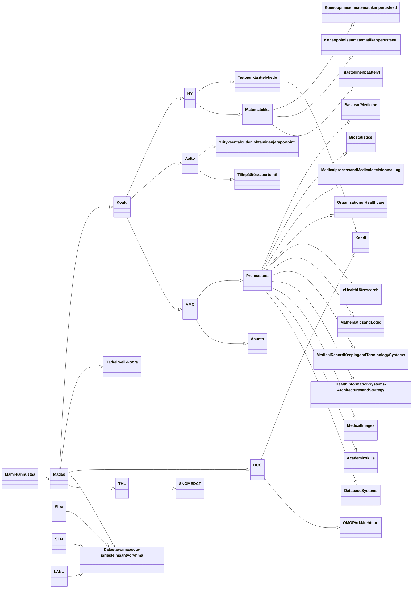

# SNOMED-CT-PAT-FI-EN
status: draft

## Käyttöohjeet
Vain englanninkielisten rivien (lang = en) päivittäminen on mahdollista.

### Huomioita edelliseen versioon verrattuna
- Alkamis- ja päättymispäiviä ei tarvitse enää määritellä. Kone hoitaa ne automaattisesti. Niiden arvot päätetään erikseen päivityksen yhteydessä siten, että ne ovat yhdenmukaiset.
- Käsite ja termi muutosten yhteydessä tyhjennetään/muokataan vain sct sarake. Siitä tulee ns master sarake. Aiemmin päivittäjän täytyi muuttaa myös legacy sarakkeen loppu osaa.

## Uudet rivit
status sarakkeen arvon tulee olla "new"

## Inaktivoitavat rivit
status sarakkeen arvon tulee olla "inactivate"

## Muokattavat rivit

#### Pakolliset
- en-rivin alle tehdään uusi rivi jolla täytyy olla sama lineid kuin editoitavalla rivillä. status sarakkeen arvon tulee olla "edit"!
- Älä myöskään koske vanhan rivin sct_temid_en sarakkeeseen!
- Muista laitaa inaktivoinnin selitys sarakkeeseen reason_for_inactivation.
- Ei tarvitse laittaa päättymispäivää tai alkamispäivää, koska kone hoitaa sen automaattisesti. Määritellään erikseen päivityksen yhteydessä.

#### Käsite muutos
- Tyhjennä käsitteen sct_conceptid sarake. Tai laita uusi arvo jos tiedossa.
- Jos ei tapahdu termi muutosta, niin ei tarvitse koskea termid sarakkeisiin. Kone hoitaa termid muutokset automaattisesti käsitteen muutoksen yhteydessä.
- Termin muuttuessa jos haluat uudet generoidut termid:t, niin tyhjennä sct_termid sarakke. Tai laita uusi arvo sct_termid sarakkeeseen jos tiedossa.

#### termi
- Laita uusi termi sct_term sarakkeseen. Jätä sct_termid sarake tyhjäksi jos haluat generoidun id:n. Voit laitaa myös uuden termid:n tilalle.

### Logiikka
- Ota Excelistä vain englanninkieliset rivit.
- Filtteröi ja jaottele rivit status sarakkeen arvon mukaan (new, edit, inactivate).
- New on suht triviaali. Luodaan tarvittavat id:t jne ja sitten luodaan identtiset kielirivit suomeksi ja ruotsiksi.
- Inactivate on myös suht triviaali. Inaktivoi englanninkielinen rivi ja sitten inaktivoi suomen- ja ruotsinkieliset rivit.
- Edit on hieman vaikeampi tapaus. Ensi ajatuksella olisi parasta liputtaa muutos tyypi ja sitten määritellä "hoitopolku".
- Käsite muutos eli sct_conceptid on tyhjä. 
    - 

new_concept
new_term
nationalize_concept
nationalize_term
fsn
administrative
new
inactivate
activate
other

