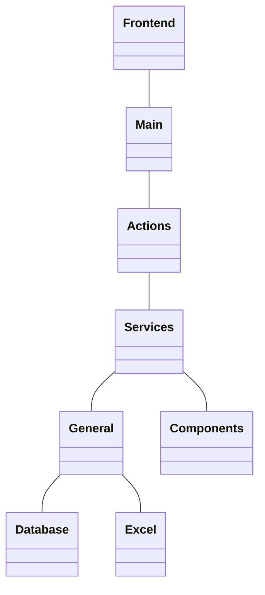

# Technical design document


## Introduction
This document describes the technical design of the project. It is intended to be read by developers and technical stakeholders. The document is divided into the following sections:

- [Folder Structure](#folder-structure)
- [Basic Structure](#basic-structure)
- [Frontend](#frontend)
- [Backend](#backend)
    - [Main](#main)
    - [Actions](#actions)
    - [Services](#services)
        - General
        - Components
    - [Config](#config)
        - [.env](#env)
- [Environment](#environment)

## Folder Structure
```bash
.
├── README.md
├── files
│   ├── download
│   ├── rf2release
│   └── upload
├── poetry.lock
├── pyproject.toml
├── src
│   ├── Home.py
│   ├── actions
│   │   ├── activate.py
│   │   ├── administrative.py
│   │   ├── fsn.py
│   │   ├── inactivate.py
│   │   ├── new.py
│   │   ├── new_concept.py
│   │   ├── new_term.py
│   │   └── other.py
│   ├── config.py
│   ├── intl
│   │   ├── PostgreSQL
│   │   │   ├── README.md
│   │   │   ├── Verhoeff.sql
│   │   │   ├── copy_kanta_table.sql
│   │   │   ├── create-database-postgres.sql
│   │   │   ├── environment-postgresql.sql
│   │   │   ├── indexing-postgres.sql
│   │   │   ├── load-postgresql.sql
│   │   │   ├── loadFileToDatabase.sql
│   │   │   ├── load_release-postgresql.sh
│   │   │   └── tmp_loader.sql
│   │   ├── create_snap_views.sql
│   │   └── rf2release
│   ├── main
│   │   ├── check.py
│   │   ├── cs_format.py
│   │   ├── intl_compare.py
│   │   └── update.py
│   ├── pages
│   │   ├── 00_Update.py
│   │   ├── 01_Code_Server_Format.py
│   │   ├── 02_Check.py
│   │   ├── 03_International.py
│   │   ├── 04_Compare_to_Intl.py
│   │   ├── 05_Files.py
│   │   └── assets
│   │       └── thl_logo_fi.png
│   └── services
│       ├── components
│       │   ├── get.py
│       │   ├── post.py
│       │   ├── put.py
│       │   └── set.py
│       └── general
│           ├── database.py
│           ├── excel.py
│           └── verhoeff.py
├── tasks.py
└── technical_design_document.md
```

## Basic Structure
The project is divided into two main parts: the frontend and the backend. The frontend is responsible for displaying the user interface, while the backend is responsible for handling the business logic and data storage.



## Frontend
The frontend is built using Streamlit, a Python library for creating web applications. Streamlit allows us to create interactive web applications with minimal code.
The entrypoint for the UI or in this case the Streamlit app is Home.py. It drives the pages and the navigation.

Pages folder includes all of the pages that are displayed in the Streamlit app. Each page is a separate Python file that contains the layout and logic for that page.
These pages take in the user input and change the .env file accordingly. The .env file is later on read by the backend.

The pages call the main functions from the main folder that are responsible for the business logic.

See the [Streamlit documentation](https://docs.streamlit.io/library) for more information.

## Backend

The backend consists of several parts: main, actions, services, and config.

### Main
The main folder contains the main functions that are responsible for the business logic of the application. These functions are called by the pages in the frontend.
Currently it includes two files that orchestrate the whole process for updating the SNOMED CT PAT FI database and converting database table to Code Server format.
These functions utilize the services and actions to perform the necessary operations.

### Intl
Contains the code for loading the SNOMED CT international rf2 release to the database and the code for creating the snap views that are used for querying.

### Actions
Here we have a file for each update type. The files only contain the function that is responsible for the update type. The functions are called by the main functions.
The actions use the services to perform the necessary operations.

### Services
The services folder contains two subfolders: general and components.
Here we have common functions or general tools that are used by almost every action or main function.

#### General
These functions are responsible for interacting with the database, reading and writing Excel files, and performing the Verhoeff check digit calculation.

#### Components
These functionalities are mostly named after http methods. They are responsible for making row wise operations that are widely used. It includes functions for getting, posting, putting, and setting data.

### Config
The config file contains the configuration for the application. It is used to store environment variables and other configuration settings.

#### .env
The .env file contains the environment variables for the application. They are set by the user in the UI Form. The .env file is read by the config file and used to configure the application.

## Environment
The environment for the application is managed using Poetry. Poetry is a Python dependency management tool that allows us to manage dependencies and virtual environments.
To simplify the commands, library invoke is used. The tasks.py file contains the commands for managing the environment and running the application.

See the [Poetry documentation](https://python-poetry.org/docs/) for more information.
    